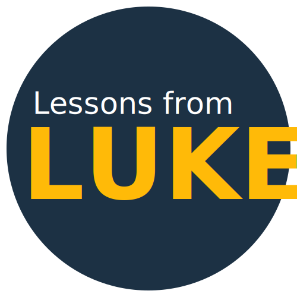

<p align="center">
  
</p>

<h1 align="center">Lessons from Luke</h1>

<p align="center"><em>Sunday School curriculum for every language.</em></p>

<p align="center">
  <a href="https://github.com/silcam/lessons-from-luke/actions/workflows/build.yml"></a>
  
  
  
  
</p>

**Lessons from Luke** is a translation and publishing tool that turns a single set of
English Sunday School lessons (based on the Gospel of Luke and Acts) into finished,
print-ready lesson booklets in any language — including minority and mother-tongue
languages, and including translators who often work with little or no internet.

It is built and used by [SIL](https://www.sil.org/), with roots in SIL Cameroon.

---

## Why this exists

Bible-based Sunday School curriculum is written once, in English, as carefully
formatted documents (titles, lesson text, coloring pages, scripture references).
Getting that curriculum into the hands of children in their own language normally
means re-typesetting every lesson from scratch for every language — slow, error-prone,
and easy to get the formatting wrong.

Lessons from Luke solves three problems at once:

1. **Translate without touching layout.** The original lesson is an OpenDocument
   (`.odt`) file. The app pulls out just the translatable text, lets a translator
   work through it string by string, then drops the translations back into the
   original document. Formatting, structure, and design are preserved automatically.

2. **Work offline, in the field.** Many translators live in places with intermittent
   or no internet. The desktop app stores everything locally so a translator can do
   weeks of work fully offline, then sync their changes to the server the next time
   they have a connection.

3. **See progress across many languages at once.** An administrator can upload source
   lessons, add languages, and track how far each language has gotten — lesson by
   lesson — from one place.

### Value to the user (the translator)

- Translate in a focused, one-string-at-a-time interface with the source text and a
  **live preview** of the real lesson document side by side.
- Every translation auto-saves and keeps a revision history.
- Optionally see a reference translation from another language (not just English) as
  a source, which helps related languages translate faster.
- Mother-tongue languages only have to translate the strings that actually matter for
  them — the app skips the rest, saving real effort for small language communities.
- Work entirely offline on the desktop app; sync when you can.

### Value to an organization or community

- One canonical English curriculum feeds an unlimited number of language editions —
  no duplicated typesetting, no drift between versions.
- Finished lessons export back to `.odt`, ready to print and distribute locally
  (e.g. `Swahili_Luke-Q2-L15.odt`).
- Central visibility into translation progress across every language and lesson.
- Scripture can be imported in **USFM** (the standard Bible-text format) to provide
  accurate reference text for translators.

---

## The translation experience

<!-- TODO: capture and commit art/screenshots/translate-view.png, then uncomment the image below. -->
<!--  -->

Translators work **one string at a time**, with the source text and a **live preview** of
the real lesson document side by side. Every edit auto-saves with full revision history,
and a per-lesson progress bar shows how much is left. Mother-tongue languages only see the
strings they actually need to translate.

---

## Who uses it

| Role | Where | What they do |
| --- | --- | --- |
| **Administrator** | Web | Logs in, creates languages, uploads English source lessons (`.odt`), imports reference scripture (USFM), and tracks progress across all languages. |
| **Translator** | Web **or** Desktop | Works in one target language, translating lesson strings with source text and a live preview. Can work fully offline on the desktop app and sync later. |

---

## How it works (end to end)

1. **Author once.** Sunday School lessons are written in English as `.odt` documents,
   organized by Book (Luke / Acts), Series, and Lesson number.
2. **Upload.** An administrator uploads the source lessons. The server parses the
   document and extracts the translatable strings, remembering exactly where each one
   lives in the original file.
3. **Add a language.** The administrator creates a target language and chooses which
   language its translators will see as their source (English by default).
4. **Translate.** A translator works lesson by lesson, string by string. Each lesson
   shows a completion bar; each string shows the source and a live preview of the
   rendered lesson.
5. **Sync (if offline).** Desktop translators accumulate work locally and sync the
   deltas back to the server when they have connectivity.
6. **Publish.** Completed lessons are exported back to `.odt`, ready to print and use.

### Key concepts

- **LessonString** — a single translatable piece of a source document, with its
  location (xpath) and a type (`content`, `styles`, or `meta`).
- **TString** — one translation of a LessonString into a specific language, with
  revision history and an optional reference source.
- **Lesson** — a unit of curriculum, identified by Book, Series, and Lesson number.
- **Language** — a target language, its chosen source language, and its progress.

---

## Development

> This is the quick path. For the full picture — the Docker dev environment, the three
> isolated environments (production / development / test), database setup, and the
> architecture overview — see [`CLAUDE.md`](./CLAUDE.md).

**Prerequisites:** [Node 24](./.nvmrc) (`nvm use`), [Yarn](https://yarnpkg.com/), and
PostgreSQL. The fastest way to get a working database + secrets is the Docker
environment described in [`CLAUDE.md`](./CLAUDE.md).

```bash
git clone https://github.com/silcam/lessons-from-luke.git
cd lessons-from-luke
yarn install
```

Create a `secrets.json` in the repo root with your PostgreSQL connection details (the
Docker environment generates one automatically; see [`CLAUDE.md`](./CLAUDE.md) for the
expected shape). Then run migrations and start the dev server:

```bash
yarn migrate      # set up the database schema
yarn dev-web      # webpack-dev-server + TypeScript watch + Express
```

To also run the Electron desktop client (requires `dev-web` to be running):

```bash
yarn dev-desktop
```

## Test

```bash
yarn test         # Jest in watch mode
yarn test-watch   # alias
```
