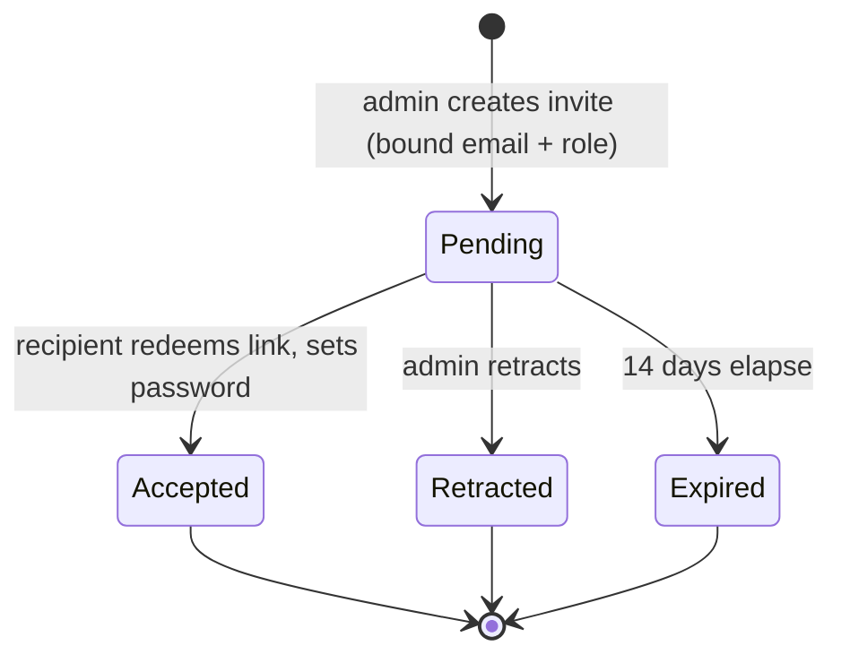

# Invitation System (admin-issued, single-use sign-up links)

## Problem Frame

The better-auth migration (`001-better-auth-migration`) intentionally shipped account
creation as **invitation-only** but with **no invitation flow** — public sign-up is globally
disabled (`disableSignUp: true`) and the only account is the migration-seeded admin. Any
additional account today has to be provisioned out-of-band, directly against the auth tables.
That is fine for one admin but blocks onboarding real users.

This feature gives an admin a self-service way to onboard people: create a **single-use,
email-bound invitation**, copy its **link**, and paste it into an email they send themselves
(the system has **no email-sending capability** yet). The recipient opens the link, sets a
password, and gets an account with the role the admin chose. A second admin-only screen lets
admins see and manage outstanding invitations.

Participants: the **admin** (creates/manages invites), the **recipient** (redeems a link to
create their account), and the **server auth subsystem** (issues/validates single-use tokens
and creates the account despite global sign-up being off). The Electron desktop client is
**not involved** — it keeps per-translation access-code auth.

## Invitation Lifecycle

Only **Pending** invitations have a working link. Accepted, Retracted, and Expired are
terminal and are retained for audit/history.

## Requirements

**Invitation creation (admin-only)**

- R1. An admin MUST be able to create a **single-use** invitation **bound to a specific
  recipient email address**.
- R2. At creation, the admin MUST choose the **role** the invitation grants: **admin** or
  **standard (non-admin)**.
- R3. Creating an invitation MUST produce a **copy-pasteable invitation link** (a URL into the
  web app) the admin can paste into an email. The system MUST NOT send email itself.
- R4. Creating an invitation for an email that **already has an account** MUST be rejected with
  a clear message.
- R5. At most **one active (Pending, non-expired) invitation per email** MAY exist at a time;
  a second create attempt for the same email is rejected with a clear message until the
  existing one is retracted or expires.

**Invitation redemption (recipient)**

- R6. Opening a valid invitation link MUST present a sign-up form with the bound email
  **pre-filled and not editable**.
- R7. The recipient MUST set a **password** (and a **display name**) to create the account; the
  account is created with the **role specified on the invitation**.
- R8. An invitation MUST be **single-use** — once Accepted it can never be redeemed again.
- R9. Opening an **invalid** link (unknown, already accepted, retracted, or expired) MUST show
  a clear, non-leaky message and MUST NOT allow account creation.
- R10. Account creation via a valid invitation MUST succeed **even though public self-service
  sign-up remains globally disabled**.

**Invitation management (admin-only)**

- R11. An admin MUST be able to view a list of all invitations showing: recipient email,
  granted role, status, **creation date**, and (for Accepted) **acceptance date**.
- R12. Each invitation's status MUST be one of **Pending / Accepted / Expired / Retracted**.
- R13. An admin MUST be able to **retract a Pending invitation**; retraction immediately
  invalidates its link.
- R14. For a Pending invitation, an admin MUST be able to **re-copy its link** (a lost link
  must not force re-issuing the invite).
- R15. Each invitation MUST record **which admin created it** (audit), since invitations can
  grant admin and multiple admins may exist.

**Lifecycle & expiry**

- R16. A Pending invitation MUST **expire 14 days after creation** (default, tunable). Expired
  invitations show as Expired and their links no longer work.
- R17. Retracted and Expired invitations MUST be **retained in the list** for audit/history
  (soft terminal state, not hard-deleted).

**Constraints & isolation**

- R18. All invitation creation/management endpoints and screens MUST be **admin-only** —
  **401** when logged out, **403** for a non-admin — consistent with existing `/api/admin/*`.
- R19. The **Electron desktop client MUST remain untouched** — invitation UI and auth code stay
  web/server-only; desktop keeps per-translation access-code auth.
- R20. Invitation data is **server-only auth infrastructure**: it MUST own its storage on the
  isolated auth DB connection and MUST NOT leak into the isomorphic `core` or the desktop path
  (consistent with constitution Principle VI's server-only exemption; the domain
  `postgres@1.0.2` driver stays untouched).

## Success Criteria

- An admin creates an email-bound, role-scoped, single-use invite and copies its link; the
  recipient opens it, sets a password, and lands an account with the chosen role; reusing the
  link then fails.
- The management screen accurately reflects Pending → Accepted / Expired / Retracted, with
  creation date, acceptance date, and the creating admin.
- Retracting a Pending invite immediately kills its link.
- Public sign-up stays disabled; only valid invitations (and the seeded admin) can create
  accounts; `/api/admin/*` invitation routes enforce 401/403/200.
- Desktop is unaffected; the domain storage driver is untouched; full CI is green.

## Scope Boundaries

- **No email sending** — the link is copy-paste only.
- **No management of existing accounts** (deactivate / remove / change role of a user that
  already exists) — invitations only; account management is future work.
- No OAuth, no public self-service sign-up, no password reset.
- No bulk/CSV invites, no resend-by-email, no invite quotas or rate limits beyond what
  better-auth already applies.
- No desktop auth changes.

## Key Decisions

- **Bound-to-email invites** (not generic links): strongest accountability and a meaningful
  management screen (each invite has a known "who").
- **Role chosen per invite**: lets the admin team grow through invites while still issuing
  limited (non-admin) accounts.
- **14-day fixed default expiry**: bounds how long a copied link stays usable; tunable.
- **Soft-retain Retracted/Expired**: keep an audit trail rather than deleting.
- **Re-copyable pending link**: since there is no email send, the admin must be able to recover
  the link from the management screen.
- **Branch stacked on `001-better-auth-migration`**: this feature builds directly on the
  unmerged better-auth work, so its branch is created off `001`, not `master`.

## Dependencies / Assumptions

- Depends on `001-better-auth-migration` (better-auth 1.6.14, `requireAdmin` middleware, the
  `user.admin` boolean, the isolated auth DB connection). The new feature branch is **stacked
  off `001`**, which is not yet merged to `master`.
- A new **auth-owned `invitation` table** follows the existing better-auth DDL migration
  pattern and lives on the isolated auth connection; the domain driver and `PGStorage` are
  untouched.
- `BETTER_AUTH_URL` (already present) provides the origin for building invitation links.
- A valid `secrets.json` continues to be present wherever migrations run (CI, Docker, deploy).

## Outstanding Questions

### Resolve Before Specify

- _(none — all blocking product and scope decisions are resolved)_

### Deferred to Planning

- [Affects R10][Needs research] How to create an account for a valid invitation while
  `disableSignUp: true` stays global in better-auth 1.6.14 — e.g. a server-side
  `accept-invite` endpoint that creates the `user`+`account` rows directly (mirroring the seed
  migration), the better-auth admin plugin's `createUser`, or a token-scoped sign-up path.
  Whichever is chosen must keep Argon2id hashing consistent with `passwordHasher.ts` /
  `_argon2Params.js`.
- [Affects R1,R8,R16][Technical] Token design: generation, whether to store only a **hash** of
  the token (not plaintext), single-use + expiry enforcement at lookup, and the new
  `invitation` table schema/indexes.
- [Affects R12,R16][Technical] Test isolation: invitation rows written outside
  `TransactionalTestStorage` must be cleaned up (DELETE in the jest `afterEach`, like
  `session`/`verification`/`rateLimit`).
- [Affects R7][Technical] Confirm what better-auth requires at account creation (the `name`
  field) and finalize how the display name is collected and stored.
- [Affects R5][Technical] Exact duplicate-pending rule and how it interacts with re-inviting an
  email whose prior invite expired or was retracted.

## Next Steps

- → `/sp:02-specify` to create the formal specification — **branch stacked off
  `001-better-auth-migration`** (not `master`), beads epic, and dependency chain.
