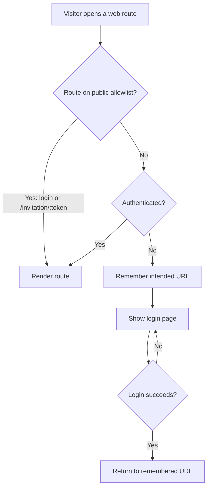

# Require Authentication on Web Content Routes

## Problem Frame

The better-auth migration (`001`) and the invitation system (`002`) gave the app real
accounts and a way to onboard people — but the **web translation experience is still wide
open**. Anyone who is handed a link like `/translate/6YI9AHY` can open the page and translate
without an account; possession of the language code is the only gate. Now that authenticated
users exist, the web app should require a logged-in user to reach its content routes.

This feature adds that gate **on the web client only**. Two hard constraints shape it:

- **Desktop stays completely auth-free.** The Electron app is offline-first and renders a
  different React tree (`desktopApp.tsx` → `MainPage`) than the web app (`webApp.tsx` →
  `MainRouter`). It has no session and must keep working with zero changes. Desktop-integrated
  authentication is a deliberate **future feature**.
- **The server API is shared and indistinguishable.** Web and desktop call the same `/api/*`
  routes; the server cannot tell an anonymous web browser apart from the desktop app (neither
  sends a session). So honest server-side gating of the shared endpoints is **not possible
  until desktop has its own credential** — that, plus per-translation authorization, is also
  future work.

Given those constraints, the right-sized step now is a **web-client route guard**: gate the
web app's routes behind login, leave the JSON API and desktop untouched, and defer real API /
translation authorization to the feature that gives desktop a credential.

Participants: the **web visitor** (must log in to reach content), the **web app router**
(enforces the gate and the post-login return), and the **existing auth session** (already
loaded on mount via better-auth). The **desktop app** and the **server API** are explicitly
out of the change.

## User Flow

## Requirements

**Web authentication gate**

- R1. On the **web app**, every route MUST require an authenticated (logged-in) user before
  rendering its content, except routes on an explicit public allowlist (R4–R6).
- R2. A logged-out visitor who navigates to — or deep-links into — a gated route MUST be sent
  to the **login page** instead of seeing the gated content.
- R3. Admin routes MUST continue to require an **admin** user (unchanged): a logged-in
  non-admin reaching an admin route keeps today's behavior (route not rendered; admin API
  returns 403).

**Public allowlist (no login required)**

- R4. The **login page** MUST remain reachable without authentication.
- R5. The **invitation-redemption route** (`/invitation/:token`) MUST remain reachable without
  authentication — recipients do not yet have an account when they open it.
- R6. Gating MUST be **default-deny**: a web route is public only if explicitly added to the
  allowlist, so newly added routes are protected automatically.

**Post-login navigation**

- R7. When a logged-out visitor is redirected to login from a gated route, a **successful
  login MUST return them to the originally-requested URL**, including its path params (e.g.
  `/translate/6YI9AHY`).
- R8. A user who logs in **without** having been redirected from a gated link lands on the
  **home page**, as today.
- R9. Logging out (or having no session) from a gated page MUST leave the user on the login
  page, not on gated content.

**Desktop & API isolation**

- R10. The **Electron desktop client MUST remain entirely free of authentication checks** — no
  login, no session, and no changes to the desktop shell or its API client. The guard lives in
  the web-only `MainRouter`, which desktop never renders.
- R11. This feature MUST **not** change the server-side JSON API — no new auth middleware on the
  shared `/api/*` endpoints — because web and desktop are indistinguishable there. Server-side
  API authorization is deferred to the future desktop-auth / translation-authorization work.

## Success Criteria

- A logged-out web visitor opening `/translate/<code>` is sent to login; after logging in they
  land **back on** `/translate/<code>` and can translate.
- A logged-in web user uses the translation surfaces normally, with no extra friction.
- The login page and the invitation-redemption link both work **without** logging in.
- The desktop app behaves exactly as before: no login prompt, no session, no code changes to
  the desktop shell; offline translation and sync still work.
- No server `/api/*` route changes; full CI (type-check, lint, unit, E2E) is green.

## Scope Boundaries

- **No server-side API gating/hardening.** Shared `/api/*` endpoints stay as open as they are
  today; this is a client-side gate only. (Deferred — needs a desktop credential first.)
- **No translation-level authorization** (which user may edit which language). Future feature.
- **No desktop authentication integration.** Future feature.
- **No change to the standard (non-admin) user's home/landing experience** beyond what already
  exists — a logged-in non-admin lands on the current logged-in home.
- **No new login UI and no public sign-up** — reuse the existing login page; invitation-only
  account creation is unchanged.

## Key Decisions

- **Web route guard, not server-side gating**: web and desktop are indistinguishable at the
  shared API, so honest server gating requires desktop credentials = future work. A client-side
  guard is the right-sized, honest step now and matches the stated future roadmap.
- **Guard lives in `MainRouter` (web-only)**: because desktop renders `MainPage` instead, the
  gate is structurally incapable of affecting desktop — no platform flag needed to exclude it.
- **Default-deny allowlist**: safer than enumerating protected routes; new routes are gated
  automatically. Public allowlist = login page + `/invitation/:token`.
- **Deep-link return-to**: shared `/translate/<code>` links and invite-then-translate flows
  depend on landing the user back where they intended after login.

## Dependencies / Assumptions

- Builds on `001-better-auth-migration` (session, `authClient`, `currentUserSlice`,
  `loadCurrentUser`) and `002-invitation-system` (the `/invitation/:token` redemption route,
  which must stay public). This branch is **stacked on `002-invitation-system`** (the current
  branch), which may still be unmerged.
- `loadCurrentUser` already runs on app mount and populates `currentUserSlice`
  (`user | null`, plus a `loaded` flag). The guard relies on that existing state rather than
  introducing a new auth source.
- The existing login page (`PublicHome`) is reused as the redirect target; no new login screen.

## Outstanding Questions

### Resolve Before Specify

- _(none — all blocking product and scope decisions are resolved)_

### Deferred to Planning

- [Affects R2,R7][Technical] The guard must wait for `currentUserSlice.loaded` before deciding,
  so an authenticated user is not briefly redirected during initial session load (no redirect
  flicker).
- [Affects R7][Technical] How to preserve and restore the intended destination across the login
  redirect (router state vs. query param), and constrain it to **same-app relative paths** to
  avoid an open-redirect.
- [Affects R9][Technical] Whether logout / mid-session expiry should actively eject the user (an
  API 401 interceptor) or only redirect on the next navigation. Leaning "next navigation only"
  for now, since the API stays open.
- [Affects R8][Technical] Confirm the standard (non-admin) logged-in home (currently shared with
  the admin home view) is acceptable, or file a follow-up to differentiate it.
- [Affects R10][Needs research] Confirm the desktop tree never imports `MainRouter`/the guard,
  so the gate is provably web-only.

## Next Steps

- → `/sp:02-specify` to create the formal specification — branch **stacked on
  `002-invitation-system`**, beads epic, and dependency chain.
