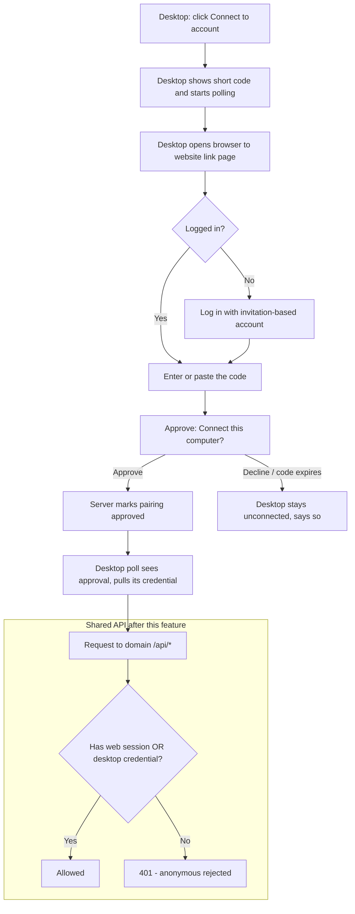

# Desktop App Authentication (Code-Based Browser Pairing) + Shared-API Enforcement

## Problem Frame

The web-auth-gate (`003`) put a login guard in front of the **web** app's routes — but that
guard is currently **cosmetic**. Web and desktop call the same shared `/api/*` routes, the
desktop sends no credential, and the server cannot tell an anonymous browser from the desktop
app. So anyone can hit `/api/languages`, `/api/sync/*`, or `POST /api/tStrings` directly (e.g.
with `curl`) and read or write curriculum data without an account. The `003` brainstorm said as
much, and explicitly deferred both **server-side API gating** and **desktop authentication** to
"the feature that gives desktop a credential."

**This is that feature.** Giving the Electron desktop app its own credential is what finally lets
the server _require_ authentication on the shared API — closing the real hole the web guard left
open. Concretely, this feature does two linked things:

1. **Desktop pairing.** From the desktop app, a translator clicks **"Connect to account,"** the
   desktop shows a **short code** and opens their browser to the website's link page; they log in
   (if not already), **enter or paste the code**, approve connecting _this_ computer, and the
   desktop — which has been polling — is connected to their account. **No loopback localhost
   server and no custom URL scheme** (deliberate choice): the desktop only makes outbound HTTPS
   calls.
2. **API enforcement.** Once a real credential exists for both clients, the server starts
   **requiring authentication on the shared domain `/api/*` routes**, accepting the web app's
   existing session _and_ the paired desktop's credential, and rejecting anonymous callers.

Two existing facts make this tractable (confirmed by codebase research):

- The desktop's HTTP calls originate in the **Electron main process** (Node/Axios via IPC), _not_
  the renderer — so it can set an `Authorization` header free of browser-CORS constraints, making
  a bearer-style credential clean.
- The invitation system already ships a proven **secret-token recipe** (256-bit random secret →
  SHA-256 hash lookup → AES-256-GCM at rest) that the pairing credential can reuse.

Participants: the **translator** (clicks Connect, logs in + approves once), the **desktop app**
(initiates pairing, stores and sends the credential, works offline regardless), the **web
browser** (carries the login + approval), and the **server auth + API** (issues the credential
and enforces it on the shared routes). Out of scope this round: per-user/per-language
authorization, and any social/third-party OAuth.

## User Flow

## Requirements

**Code-based pairing (desktop → browser → enter code → approve)**

- R1. The desktop app MUST provide a **"Connect to account"** action that starts pairing by
  **displaying a short pairing code** and opening the user's web browser to the website's
  device-link page. The code MUST be easy to read and **copy** from the desktop.
- R2. In the browser the user MUST authenticate (or already be logged in), **enter or paste the
  code** shown by the desktop, and then **explicitly approve** connecting _this_ computer to their
  account. The desktop learns the result by **polling** — there MUST be **no loopback localhost
  server and no custom URL scheme**. The link/consent screen MUST follow the existing design
  system (`DESIGN.md` / base-components; consistency over novelty).
- R3. On approval the desktop (which is polling) MUST become **connected and bound to the specific
  user account that approved**, with no further steps. If the user declines, or the code expires
  before approval, the desktop MUST remain unconnected and clearly say so.
- R4. The pairing handshake MUST be secure: the pairing code MUST be **short-lived and single-use**;
  the desktop's polling secret MUST **never be exposed** in the browser or URL; and the design MUST
  ensure a forged/cross-site request or a mistaken party entering the code cannot bind the desktop
  to the **wrong** account (at worst it harmlessly consumes the code).

**Shared-API enforcement (server-side gate)**

- R5. The server MUST **require authentication on the shared domain `/api/*` data routes**
  (languages, lessons, tStrings, sync, and peers). Anonymous requests MUST be rejected (401).
- R6. The gate MUST accept **both** the web app's existing logged-in session **and** a paired
  desktop's credential, so both clients keep working unchanged from the user's point of view.
- R7. Enforcement MUST NOT break the **pre-login public surface**: the login flow and the
  anonymous invitation lookup/redemption endpoints (`/api/auth/invitation/*`) MUST remain
  reachable without authentication.

**Desktop online/offline behavior**

- R8. An **unpaired or disconnected** desktop MUST keep working **offline from its local cache**;
  it simply cannot sync with the server until connected. Offline-first is preserved.
- R9. When unpaired/disconnected **and online**, the desktop MUST clearly indicate it is **not
  connected** and prompt the user to connect, rather than failing sync silently.
- R10. Once paired, the desktop MUST **stay connected across app restarts** and **automatically
  resume syncing** when online, with **no re-approval** in normal use.

**Credential lifecycle & revocation**

- R11. The desktop MUST provide a **"Disconnect"** action that clears its local credential and
  returns it to the unconnected state.
- R12. A paired desktop's access MUST be **revocable server-side** so a lost/stolen device can be
  cut off; a revoked credential MUST stop working on its next online request. (Minimal trigger
  surface; **no full device-management UI** in v1.)

**Isolation & continuity constraints**

- R13. The desktop MUST obtain and use its credential by calling the server's **auth endpoints
  over HTTP**; server-only auth code (better-auth) MUST NOT be imported into the isomorphic
  `core` or the desktop offline path (constitution Principle VI).
- R14. This feature MUST NOT add third-party/social login. Pairing authenticates against the
  **existing invitation-only accounts**; public sign-up stays disabled.
- R15. The desktop's existing **language-code selection** MUST continue to coexist with user
  authentication: the 3-letter code still selects the working language; the user credential
  proves identity. No change to how languages are chosen.

## Success Criteria

- On a fresh desktop install, a translator clicks **Connect to account**, logs in once in the
  browser, **enters/pastes the short code** the desktop shows, approves, and the desktop is
  connected **as them**, then syncs.
- Closing and reopening the desktop keeps it connected and syncing — **no re-login**.
- An anonymous request to a domain `/api/*` route (e.g. `curl`) is **rejected (401)**, while the
  logged-in web app and the paired desktop both keep working.
- The **login page** and the **invitation redemption** link still work without logging in.
- **Disconnect** on the desktop clears the credential; **revoking** the device server-side stops
  its access on the next online call.
- Offline, an **unpaired or disconnected** desktop still works from its local cache.
- Full CI green: type-check, lint, unit, web E2E (Cypress), desktop E2E (Playwright + Electron).

## Scope Boundaries

- **No per-user / per-language authorization** (which user may edit which language) — future
  feature. v1 is authentication (identity) only.
- **No full device-management UI** (device list, naming, last-seen) — only Disconnect + revocable.
- **No third-party / social OAuth** and **no public sign-up** — pairing uses existing
  invitation-based accounts.
- **No loopback-localhost and no custom-URL-scheme pairing** — by deliberate choice the user
  enters/pastes a short code (device grant, RFC 8628) and the desktop polls; it never runs a local
  listener or registers an OS URL scheme.
- **No change to how the desktop selects a working language** (the 3-letter code stays).
- **No changes to invitation onboarding** or account types.

## Key Decisions

- **Pair AND enforce in one feature**: the desktop credential is precisely what lets the server
  honestly require auth on the shared API; pairing without enforcement would leave the hole open.
- **Authentication only in v1**: prove a real account is behind every request; defer per-language
  authorization.
- **Code-based pairing (device grant), loopback explicitly rejected**: the user enters/pastes a
  short code shown by the desktop, and the desktop learns the result by **polling** (RFC 8628).
  Chosen over the seamless loopback/URL-scheme flows because it needs **no inbound listener and no
  OS scheme registration** — only outbound HTTPS — which is the most robust across locked-down
  machines, AV, and corporate firewalls for a field tool. The small cost is the user copying a
  short code.
- **Revocable credential, minimal lifecycle surface**: Disconnect (local) + server-side revoke,
  no device-list UI — closes the lost-laptop gap without much extra build.
- **Native-app pairing against existing better-auth accounts**, not social OAuth.
- **High-level technical direction** (this feature is inherently auth infrastructure): the desktop
  credential is expected to be a **bearer-style, non-cookie token** so it works from the Electron
  main process without a browser origin and is inherently **CSRF-safe**; reuse the invitation
  token recipe (random secret → SHA-256 hash lookup → AES-256-GCM at rest) if a bespoke token is
  needed. Final mechanism (better-auth plugin vs bespoke endpoint) is decided in planning.

## Dependencies / Assumptions

- Builds on `001-better-auth-migration` (accounts, sessions, `requireUser`) and `003-web-auth-gate`
  (the web client guard). Per the stacked-PR convention, this branch is likely **stacked on
  `003-web-auth-gate`** (the current branch), which may still be unmerged.
- Desktop HTTP calls run in the **Electron main process** (Node/Axios), so an `Authorization`
  bearer header is unaffected by browser CORS — confirmed by research.
- better-auth currently has **no OAuth/device/bearer plugins installed**; planning chooses between
  a better-auth plugin (bearer / device-authorization / api-key) and a bespoke pairing endpoint.
- **Rollout/version-skew risk**: desktops already deployed in the field that haven't updated will
  lose anonymous sync the moment enforcement flips — this needs a coordinated desktop release and
  enforcement sequencing (see Deferred to Planning).

## Outstanding Questions

### Resolve Before Specify

- _(none — all blocking product and scope decisions are resolved)_

### Deferred to Planning

- [Affects R1–R4][Technical] Device-grant specifics (mechanism is decided — code + polling, no
  loopback/scheme): **code format and length** (human-readable, copy-friendly; e.g. grouped
  alphanumeric), **code + polling-secret expiry**, **poll interval and backoff** (and how the
  desktop surfaces "waiting for approval" / "code expired"), and whether the desktop auto-opens
  the browser to the link page. Reuse the invitation token recipe (random secret → SHA-256 hash
  lookup → AES-256-GCM at rest) for the polling secret.
- [Affects R5–R6][Technical] How the API gate accepts **both** a cookie session and a desktop
  bearer token, and how `requireSameOrigin`/CSRF interacts (bearer tokens are CSRF-safe; cookies
  rely on same-origin). Likely a unified `requireUser` that checks `Authorization: Bearer` then
  the cookie session.
- [Affects R5][Technical] The **exact set** of domain `/api/*` routes to gate; confirm no
  pre-login web flow calls a domain route before authentication.
- [Affects R10,R12][Technical] **Credential model & lifetime/renewal** (long-lived/auto-renewing
  token vs better-auth session), revocation representation (e.g. a `revokedAt`/revoked state), and
  **secure at-rest storage** of the credential on the device.
- [Affects R2][Technical] Whether to use a **better-auth plugin** (the **device-authorization**
  plugin is now the natural fit, optionally with the bearer plugin for the resulting credential)
  vs a **bespoke pairing endpoint** reusing the invitation token recipe. Note better-auth has no
  plugins installed today, so either path adds a dependency or new endpoints.
- [Affects rollout][Needs research] **Enforcement rollout sequencing** against deployed desktop
  versions — whether a grace period, feature flag, or forced-update is needed to avoid breaking
  field installs during the version-skew window.

## Next Steps

- → `/sp:02-specify` to create the formal specification — branch (likely **stacked on
  `003-web-auth-gate`**), beads epic, and dependency chain.
