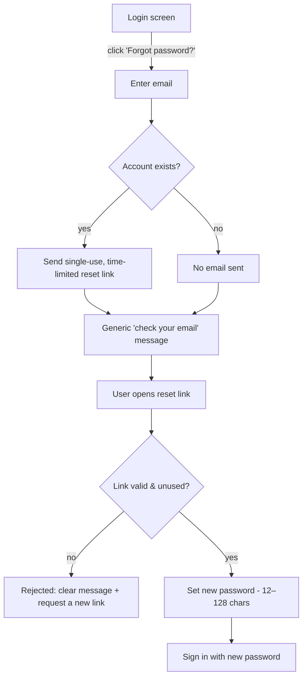

# Transactional Email & Self-Service Password Reset

## Problem Frame

The app has **no transactional email at all** today. Two consequences:

1. **Locked-out users cannot self-recover.** Public signup is disabled and accounts
   are admin-issued, so a web user who forgets their password has no way back in
   without out-of-band admin intervention. Better-auth already supports password
   reset — it just has no email transport wired to it.
2. **Invitation links are delivered by hand.** When an admin creates an invitation,
   the link is shown in a copyable textbox and the admin must manually send it to the
   invitee through some other channel.

Adding a single server-only email capability (Mailgun) unlocks both: a self-service
password-reset flow for end users, and automatic delivery of invitation links, closing
a manual gap that exists right now.

## User Flow — Password Reset

The response at **F** is identical whether or not the email is registered (no account enumeration).

## Requirements

**Transactional Email (Foundation)**

- R1. Introduce a server-only transactional email capability backed by Mailgun, callable
  by any server-side flow that needs to send mail. It must not be imported into the
  isomorphic core or the desktop offline path (constitution Principle VI server-only exemption).
- R2. Email delivery is **environment-gated**. Production requires valid Mailgun
  configuration and fails fast at startup if it is missing or left at defaults
  (consistent with the existing `cookieSecret` / `adminPassword` / `BETTER_AUTH_URL`
  startup guards). Development and test use a log/console transport that records the
  rendered email — including any links — instead of sending, so links remain recoverable locally.
- R3. Mailgun configuration is added to the secrets/config structure and validated at
  startup following the existing fail-fast pattern. Secret values are never logged
  (field names only).

**Self-Service Password Reset**

- R4. A logged-out web user can request a password reset by entering their email from a
  "Forgot password?" entry point on the login screen.
- R5. A single-use, time-limited reset link is sent to the email **only if** an account
  exists, but the user-facing response is always identical regardless of whether the
  email is registered (no account enumeration).
- R6. Following a valid reset link presents a screen to set a new password (subject to
  the existing 12–128 char policy), after which the user can sign in with it. Used or
  expired links are rejected with a clear message and a path to request a new one.
- R7. Password reset applies to all web accounts that authenticate by email + password,
  including the admin. Desktop access-code authentication is unaffected.

**Invitation Auto-Delivery**

- R8. When an admin creates an invitation, the system automatically emails the invitation
  link to the invitee's email address.
- R9. The admin invitation UI continues to show the copyable invitation link and adds a
  "Resend email" action for pending invitations (not yet accepted, expired, or retracted).
- R10. Invitation emails reuse the shared email capability (R1) and respect the same
  environment-gating (R2).

## Success Criteria

- A web user who forgets their password regains access end-to-end without admin
  intervention.
- An admin can invite a new user without manually copying or sending the link; the
  invitee receives it by email, with copy-link and resend as fallbacks.
- In production the server refuses to start with missing/default Mailgun config; in
  dev/test, reset and invite links are obtainable from logs without a real mail provider.
- No flow reveals whether a given email address is registered.

## Scope Boundaries

- **No** email-verification step added to signup/invitation acceptance — auto-emailing
  the invitation to the bound address already proves inbox control.
- **No** change to desktop access-code authentication.
- **No** general-purpose notification or email-campaign system — only the two
  transactional flows above plus the reusable module they share.
- **No** re-enabling of public self-service signup; `disableSignUp` stays.
- **No** SMS or alternate delivery channels.

## Key Decisions

- **Both flows in one feature on one shared email module** — chosen for compounding
  value: invitation auto-email closes an existing manual gap at near-zero marginal cost
  once email exists.
- **Use better-auth's built-in password reset** (`sendResetPassword`) rather than a
  hand-rolled flow — less code, security-reviewed, consistent with auth already owning
  this surface.
- **Env-gated delivery with prod fail-fast** — mirrors existing secrets guards; keeps
  local dev and CI frictionless without real mail credentials.
- **Keep the link + add resend on invitations** — resilience against bounced or lost
  email; matches the utilitarian "Field Manual" register.
- **Enumeration-safe reset responses** — standard security posture; the response never
  reveals account existence.

## Dependencies / Assumptions

- A Mailgun account and verified sending domain (DNS / SPF / DKIM) is available for
  production. Provisioning and verifying it is an ops prerequisite, not code.
- Better-auth's default reset-link semantics (single-use, ~1 hour expiry) are acceptable
  unless planning finds reason to tune them.
- Email content and branding follow DESIGN.md's utilitarian register; exact copy and
  layout are design details for planning.

## Outstanding Questions

### Resolve Before Specify

- (none — the three scope-defining product decisions are settled)

### Deferred to Planning

- [Affects R3][Technical] Exact Mailgun integration surface (official SDK vs. REST via
  `fetch`) and the precise secrets field names/shape.
- [Affects R1/R6][Technical] Wire better-auth's `sendResetPassword` callback directly;
  determine how reset routes/pages slot into `MainRouter` and the `/api/auth/*`
  registration order.
- [Affects R5][Needs research] Confirm better-auth's forget-password endpoint is
  enumeration-safe by default (always generic response), or whether we must enforce it.
- [Affects R6][Product / low-cost] Optionally send a "your password was changed"
  confirmation email after a successful reset (better-auth `onPasswordReset` hook) —
  decide in planning whether the small cost is worth the security benefit.
- [Affects R2][Technical] Test strategy for the log transport (capturing/asserting
  emails and links), and whether jest setup needs to clear captured emails the way it
  already clears the `invitation` table.

## Next Steps

`-> /sp:02-specify` to create the formal specification.
