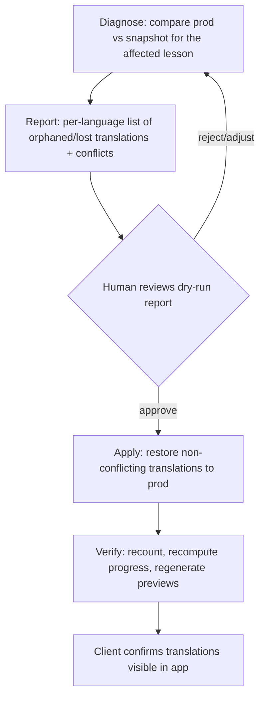

# Targeted Restoration of Luke Lesson 1 Translations

## Problem Frame

On Tuesday 2026-08-11 the client accidentally re-uploaded the master (English)
ODT document for Luke Lesson 1 in production. He believes this reset all
translation work for that lesson. Translation work in other languages has
continued since, so a full database rollback is off the table — we need a
targeted restoration.

**What a re-upload actually does (verified in code):** it never deletes
translations. `tstrings` rows survive; the upload deletes the lesson's
`lessonstrings` linkage rows (archiving them to `oldlessonstrings`) and
re-inserts fresh ones. Where the new ODT's English text is byte-identical to
the old, the existing `masterId` is reused and translations remain reachable.
Where the text differs even trivially, a new `masterId` is minted and every
language's translation of the old string becomes orphaned (present but
unreachable). A built-in diagnostic (`findTSubs` /
`GET /api/admin/lessons/:lessonId/lessonUpdateIssues`) can map old→new
masterIds across exactly one version bump.

So the deliverable is a diagnosis + re-link/copy of orphaned translations, not
a bulk table restore.

**Backup available:** a snapshot server (pre-incident, 08:00 WAT) is reachable
from the production host: `ssh 172.26.12.108` from `lukeproduction` (SSH key
passphrase provided out of band). Each host carries a
`THIS_IS_THE_PRODUCTION_SERVER` / `THIS_IS_THE_SNAPSHOT_SERVER` marker file in
the ubuntu user's home directory for positive identification.

## User Flow

## Requirements

**Diagnosis**

- R1. The script MUST positively identify which database it is reading vs
  writing (marker files / read-only connection to the snapshot) before any
  write. Writes go only to production; the snapshot is strictly read-only.
- R2. The script MUST auto-detect the affected lesson(s) by comparing
  `lessons.version`/`modified` between snapshot and production (resolving the
  "Luke Lesson 1" series ambiguity from data, not assumption), and report how
  many version bumps occurred since the snapshot.
- R3. The script MUST produce a per-language diagnosis for the affected
  lesson: strings still intact, strings orphaned (old masterId unreachable),
  and strings genuinely lost (if any), including counts and sample text.
- R4. The diagnosis MUST quantify blast radius: which affected masterIds are
  shared with other lessons (identical-text reuse) and flag those separately.

**Restoration**

- R5. Restoration is targeted: only translations tied to the affected
  lesson's orphaned/changed masterIds are touched. No bulk table copy.
- R6. Conflict policy — never overwrite newer work: a production string
  edited after the snapshot timestamp (any language, including shared
  boilerplate edited via another lesson) is left untouched and listed in the
  report for human review. Post-incident work always wins. (User decision
  2026-08-13.)
- R7. Restored values MUST go through the app's history-preserving write
  semantics (prior text appended to `history`), so every restore is
  reversible in-app.
- R8. The script MUST support a dry-run mode that produces the full
  would-change report with zero writes; the apply mode runs only after a
  human has reviewed the dry run.
- R9. Before any apply, the script (or runbook) MUST take a fresh production
  dump so the restore itself is reversible.

**Aftermath**

- R10. After apply: recompute `languages.progress` and regenerate web
  previews so the UI reflects restored state.
- R11. A final verification report MUST show before/after translated-string
  counts per language for the affected lesson, suitable for sending to the
  client.

## Success Criteria

- The client can open Luke Lesson 1 in each active language and see the
  pre-incident translations restored.
- No translation edit made after 2026-08-11 08:00 WAT is overwritten,
  anywhere in the corpus.
- Every change the script made is enumerable (report) and reversible
  (history + pre-apply dump).

## Scope Boundaries

- No schema changes, no migrations, no FK additions — operational script only.
- No re-upload of the ODT as part of recovery (each upload re-triggers the
  destructive delete/reinsert cycle and burns the one-version `findTSubs`
  lookback).
- Do NOT run `cleanDB.ts` (`consolidateEnglish` deletes translations across
  all languages) during or after recovery.
- No general-purpose backup/restore tooling; preventing recurrence (upload
  confirmation UX, automated backups) is a separate follow-up feature.
- Web/server only; desktop clients untouched except for R12's sync question.

## Key Decisions

- **Never overwrite newer work**: post-incident edits win; conflicts are
  reported, not resolved automatically. — Chosen by David over
  "backup always wins" and "ask per conflict".
- **Targeted re-link/copy, not rollback**: work has continued in other
  languages since Tuesday; full restore would destroy it.
- **Dry-run gate**: writes happen only after a human reviews the diagnosis
  report. Low-cost safeguard for an irreversible-feeling operation.

## Dependencies / Assumptions

- Snapshot server stays up and reachable from `lukeproduction` until
  restoration completes (Brian to confirm/maintain).
- The snapshot predates the incident (08:00 WAT 2026-08-11; incident later
  that day). Verify by comparing the lesson's `version` on both sides.
- Production `docs/` (a Capistrano-linked shared dir) still holds all
  historical ODT versions — an independent second recovery source for the
  prior English text if masterId mapping needs reconstruction.
- SSH key passphrase for the snapshot hop is held by David (not to be
  committed anywhere).

## Outstanding Questions

### Resolve Before Specify

- (none)

### Deferred to Planning

- [Affects R2][Technical] How many times was the lesson re-uploaded since the
  snapshot? If exactly one version bump, `findTSubs` can bridge masterIds
  automatically; if more, mapping must be reconstructed (xpath match and/or
  old-ODT text from `docs/`).
- [Affects R5][Technical] Verify `SELECT count(*) FROM tstrings WHERE
lessonstringid IS NOT NULL` — legacy lessonStringId-scoped rows are a second
  orphan vector; current code never writes them, but data may exist.
- [Affects R6][Technical] `tstrings.modified` is NULL on some write paths;
  conflict detection must fall back to value comparison (prod text ≠ snapshot
  text ⇒ treat as conflict) rather than trusting timestamps alone.
- [Affects R7][Technical] Whether to write via `POST /api/tStrings` /
  `saveTStrings` or direct SQL replicating its semantics (history append,
  `(languageId, masterId, lessonStringId)` key, no-op skip). `tstrings` has
  no PK/unique constraints, so naive INSERTs silently duplicate.
- [Affects R7][Technical] Set `modified` deliberately on restored rows:
  desktop sync pushes rows by `modified` recency — decide whether restored
  rows should propagate to desktop clients.
- [Affects R1][Technical] Connection topology: script likely runs on
  `lukeproduction` (prod DB is socket-only per `secrets.json` shape) and
  reaches the snapshot DB via SSH tunnel to 172.26.12.108.
- [Affects R9][Needs research] Where to store the pre-apply dump on the prod
  host (disk space check).

## Next Steps

-> `/sp:02-specify` to create the formal specification from this brainstorm.
